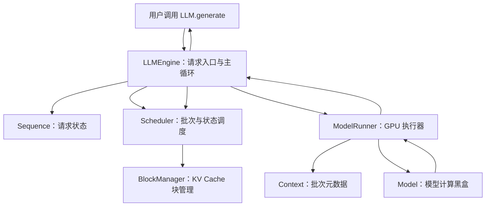
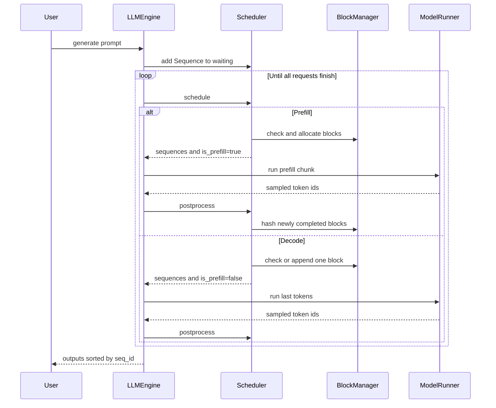
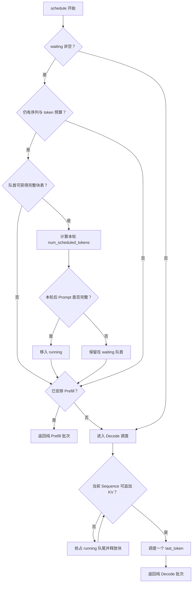
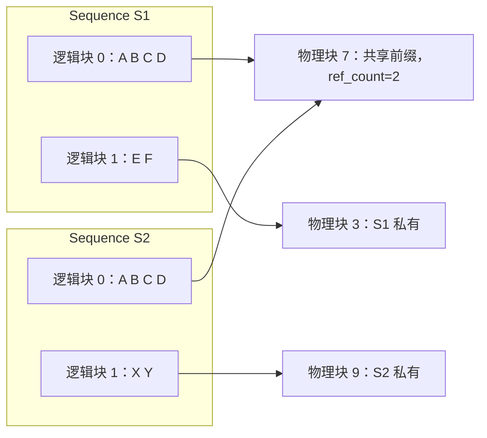

## 一、模型之外，推理引擎究竟解决什么问题

阅读大模型源码时，人们很容易把注意力全部放在 Transformer 上：Embedding 如何得到隐状态，Attention 如何计算 Q、K、V，RoPE 如何注入位置信息，MLP 又如何变换特征。但真正把模型部署为一个高吞吐推理服务时，模型前向只是问题的一部分。

推理引擎还必须回答另外一组问题：

- 多条长度不同的请求，应该如何组成 GPU 批次？
- Prompt 很长，单轮 token 预算放不下时怎么办？
- 每条请求跨越很多次 Decode，状态保存在哪里？
- KV Cache 如何分配、复用和回收，才能减少显存碎片？
- 显存不足时，应该暂停哪条请求？
- Prefill 与 Decode 的输入形态完全不同，如何分别准备张量？
- Decode 每轮计算量很小，如何降低 CPU 提交 CUDA Kernel 的开销？
- 多张 GPU 运行同一个模型时，各进程如何保持步调一致？

这些问题共同构成了推理引擎。Nano-vLLM 的价值也正在这里：它用很少的代码保留了现代 LLM 推理系统的核心骨架，让请求调度、Paged KV Cache、Prefix Cache、Chunked Prefill、CUDA Graph 和 Tensor Parallel 等机制能够被完整串起来。

`nanovllm/engine` 中有五个核心文件：

| 模块 | 核心职责 |
| --- | --- |
| `llm_engine.py` | 对接用户 API，驱动“调度—执行—回写”主循环 |
| `sequence.py` | 保存单条请求跨轮次存在的全部状态 |
| `scheduler.py` | 决定本轮运行哪些 Sequence，以及运行多少 token |
| `block_manager.py` | 管理 KV Cache 的物理块、块表、引用计数和前缀缓存 |
| `model_runner.py` | 准备 GPU 输入、执行模型、采样，并协调 CUDA Graph 与多 GPU |

整体关系如下：



这套架构最重要的分工可以概括为四句话：状态由 `Sequence` 承载，策略由 `Scheduler` 决定，KV 资源由 `BlockManager` 管理，GPU 执行细节由 `ModelRunner` 封装。`LLMEngine` 则是把四者组织起来的总指挥。

## 二、初始化：一次 `LLM(...)` 背后发生了什么

用户侧的 `LLM` 只是继承了 `LLMEngine`，真正的初始化工作都发生在 `LLMEngine.__init__` 中。它并非简单地加载模型，而是在正式接收请求前建立整套运行环境。

### 2.1 构造配置并统一块大小

`LLMEngine` 首先从关键字参数中筛选 `Config` 支持的字段，随后构造配置对象。配置会读取 Hugging Face 模型目录中的 `config.json`，得到层数、隐藏维度、注意力头数、数据类型与最大位置长度等信息。

紧接着有一行很关键的赋值：

```python
Sequence.block_size = config.kvcache_block_size
```

`Sequence` 在 CPU 侧按照 `block_size` 切分逻辑 token 块，`BlockManager` 在 GPU KV Cache 中按照相同大小管理物理块。两者必须严格一致，否则 `Sequence.block(i)`、`block_table` 和真实 KV 槽位会产生错位。

### 2.2 为 Tensor Parallel 创建进程

当 `tensor_parallel_size > 1` 时，引擎使用 `spawn` 启动 rank 1、rank 2 等子进程，主进程自身承担 rank 0。选择 `spawn` 的意义在于每个子进程会从干净的 Python 解释器启动，避免直接复制已经初始化的 CUDA 上下文。

每个 rank 都会构造一个 `ModelRunner`，并加入 NCCL 通信组。非零 rank 完成初始化后进入常驻命令循环；rank 0 留在主进程中，既参与本地模型计算，也负责把命令广播给其他 rank。

### 2.3 ModelRunner 的初始化顺序

每个 `ModelRunner` 依次执行：

1. 选择当前 rank 对应的 GPU；
2. 创建模型结构并加载本 rank 所需权重；
3. 创建采样器；
4. 使用接近配置上限的虚拟输入预热模型；
5. 根据显存峰值计算可分配的 KV Cache 块数；
6. 一次性分配整块 KV Cache 大张量；
7. 如果没有强制 eager，捕获常用 Decode batch size 的 CUDA Graph。

这里的顺序不能随意交换。模型前向除了常驻参数，还会产生临时张量、编译缓存和工作区。若在预热前就把所有“剩余显存”交给 KV Cache，正式前向到达峰值时就可能 OOM。因此代码先运行一次接近上限的 Prefill，记录峰值，再从显存预算中扣掉这部分临时开销。

设单张 GPU 上一个物理 KV 块的字节数为：

```text
block_bytes = 2
            × num_hidden_layers
            × block_size
            × local_num_kv_heads
            × head_dim
            × dtype_size
```

其中最前面的 `2` 分别代表 Key 和 Value，`local_num_kv_heads` 是 KV 头按 Tensor Parallel world size 切分后的本地数量。可分配块数近似为：

```text
num_blocks = (
    total_memory × gpu_memory_utilization
    - already_used_memory
    - warmup_peak_memory
    + current_memory
) // block_bytes
```

最终 KV Cache 是一个大张量：

```text
[2, num_layers, num_blocks, block_size, local_num_kv_heads, head_dim]
```

各 Attention 层持有的 `k_cache` 和 `v_cache` 只是这个大张量对应层的视图。CPU 侧的 `BlockManager` 不保存真实 K/V，只管理物理块编号及其元数据。

### 2.4 Tokenizer 与 Scheduler

GPU 运行环境就绪后，`LLMEngine` 加载 Tokenizer，把 EOS token id 写入配置，再创建 `Scheduler`。Scheduler 构造时会读取 rank 0 计算出的 `num_kvcache_blocks`，建立与 GPU 物理块一一对应的 CPU 管理对象。

至此，引擎才真正具备接收请求的能力。也就是说，`LLM(...)` 是重初始化操作，而 `generate(...)` 是在已经建立好的模型、KV Cache 和 CUDA Graph 上运行请求。

## 三、Sequence：贯穿整个引擎的请求状态

`Sequence` 可以理解为一张会跨越很多轮 GPU 执行的“请求进度表”。Scheduler 每轮只选择部分请求，ModelRunner 每轮只执行一次前向，因此所有需要跨轮保存的信息都必须放在 Sequence 中。

### 3.1 三类状态

Sequence 有三种状态：

- `WAITING`：等待 Prefill，或被抢占后等待重新 Prefill；
- `RUNNING`：Prompt 已完成 Prefill，正在逐 token Decode；
- `FINISHED`：遇到 EOS 或达到 `max_tokens`。

典型状态路径是：

```text
WAITING → RUNNING → FINISHED
```

显存不足发生抢占时，则会出现：

```text
RUNNING → WAITING → RUNNING
```

抢占不会删除已经生成的 token，只会释放 GPU KV Cache。之后请求回到 waiting 队首，利用保留在 `token_ids` 中的完整上下文重新 Prefill。

### 3.2 三个容易混淆的 token 计数

理解 engine 的关键，是分清下面三个字段：

| 字段 | 含义 |
| --- | --- |
| `num_tokens` | Sequence 当前拥有的 token 总数，包括 prompt 和已生成 token |
| `num_cached_tokens` | 已经执行过模型前向、拥有有效 KV Cache 的 token 数 |
| `num_scheduled_tokens` | Scheduler 为当前这一轮安排、但尚未回写完成的 token 数 |

在 Prefill 调度完成后，通常满足：

```text
num_cached_tokens + num_scheduled_tokens <= num_tokens
```

如果等号不成立，说明当前只是 Chunked Prefill 的一个片段。ModelRunner 执行结束后，`postprocess` 会把 `num_scheduled_tokens` 加到 `num_cached_tokens`，再把本轮调度数清零。

完整 Prefill 会直接产生第一个 completion token。这个 token 已经被采样并追加到 Sequence，但它自己的 K/V 尚未写入缓存。因此进入下一轮 Decode 前，常见状态是：

```text
num_tokens = num_cached_tokens + 1
```

下一轮把这个 `last_token` 送入模型后，它才成为新的 cached token，同时模型再预测下一个 token。这个“一步错位”正是自回归生成的基本节奏。

### 3.3 block_table

`block_table` 表示逻辑块到物理块的映射。假设为了讲解把 `block_size` 设为 4，一条 Sequence 当前有六个 token：

```text
逻辑块 0 = [A, B, C, D]
逻辑块 1 = [E, F]
```

若它被分配到 GPU 物理块 7 和 3，则：

```python
seq.block_table == [7, 3]
```

逻辑顺序仍然是 0、1，但物理内存无需连续。Attention 通过 `block_table` 找到历史 K/V，这就是分页式 KV Cache 的核心思想。

把这个字母示例展开到一条真实短句后，逻辑块、块表与物理块之间的关系会更加直观。下图中的 Request A 先被切成多个逻辑 KV 块；Block Table 不保存 K/V 本身，只记录每个逻辑块实际落在哪个 GPU 物理块，以及该块已有多少个有效 token。


<p align="center"><em>逻辑 KV 块经由 Block Table 映射到离散的 GPU 物理块</em></p>

图中三个逻辑块依次映射到物理块 7、1 和 3，虽然物理位置彼此分散，请求看到的 token 顺序却没有变化。`# filled` 还记录了块内有效槽位数：当新生成的 `fathers` 追加到逻辑块 1 时，只需把该块的有效数量从 3 更新为 4，不必移动前面的 KV。它与上面的 `[7, 3]` 示例表达的是同一件事：**连续的是请求的逻辑上下文，不必连续的是 GPU 上的物理存储。**

### 3.4 多进程序列化为什么区分 Prefill 与 Decode

rank 0 需要把本轮 Sequence 元数据发送给其他 TP rank。Prefill 会读取一段 prompt token，所以序列化状态中包含完整 `token_ids`；Decode 只输入最新的 `last_token`，历史信息已经存在各 GPU 的 KV Cache 中，因此只发送一个整数即可。

这不会减少 GPU 间模型内部的集合通信，但会减少主进程通过共享内存广播 Python 请求元数据的体积。

## 四、一条请求从 generate 到完成的生命周期

`LLMEngine.generate` 的主循环可以压缩成下面的伪代码：

```python
for prompt in prompts:
    add_request(prompt)

while scheduler 仍有请求:
    seqs, is_prefill = scheduler.schedule()
    token_ids = model_runner.run(seqs, is_prefill)
    scheduler.postprocess(seqs, token_ids, is_prefill)

按 seq_id 恢复提交顺序并解码
```

### 4.1 add_request：从输入到 Sequence

字符串 prompt 先通过 Tokenizer 转换成 token id；如果用户已经传入 `list[int]`，则直接使用。随后构造 Sequence，并追加到 Scheduler 的 `waiting` 队列尾部。

每条 Sequence 通过全局计数器获得单调递增的 `seq_id`。请求完成顺序可能不同于提交顺序，例如短请求可能先结束，因此结果先保存在以 `seq_id` 为键的字典中，最后排序恢复原始顺序。

### 4.2 step：引擎的最小推进单位

`step()` 只推进一轮，而不是完成一条请求。它依次完成：

1. Scheduler 选择本轮 Sequence；
2. ModelRunner 准备输入并运行 GPU；
3. Scheduler 将新 token 和缓存进度写回 Sequence；
4. 收集本轮刚刚完成的请求。

一条长请求会经历一次或多次 Prefill，再经历许多次 Decode。正因为每轮都重新调度，等待请求与运行请求才能动态组成新的批次。

### 4.3 Prefill 为什么也会返回 token

完整 Prompt 的最后一个位置会产生下一 token 的 logits。因此当最后一段 Prefill 完成时，ModelRunner 会采样出第一个 completion token，`postprocess` 将其追加到 Sequence。若只是中间的 Chunked Prefill，虽然模型前向也会得到 logits，但这些 logits 不代表完整上下文下的下一 token，调度器不会将采样结果写入 Sequence。

### 4.4 Decode 为什么只输入 last_token

更早 token 的 K/V 已经写入 KV Cache。Decode 只需输入上轮采样出的 `last_token`，通过块表读取历史 K/V，再预测新的 token。于是每条活跃请求每轮只贡献一个 Query token，这也是 Decode 能够把大量请求合并到一个 batch 中的基础。

完整时序如下：



## 五、Scheduler：如何持续组织 GPU 批次

Scheduler 不执行神经网络。它只管理请求队列、token 预算和 KV Cache 资源，然后回答两个问题：本轮运行谁，以及本轮属于 Prefill 还是 Decode。

### 5.1 waiting 与 running

`waiting` 和 `running` 都是双端队列：

- 新请求从 waiting 右侧进入；
- Prefill 通常从 waiting 左侧取，保持 FIFO；
- 完成 Prompt 的请求进入 running；
- Decode 从 running 左侧选择请求；
- 抢占时优先取 running 右端，再把被抢占请求放到 waiting 左端。

最后一点体现了一个简单策略：尽量保留更靠前、已经准备执行的请求，牺牲队尾请求释放 KV 块；被抢占者又会排到 waiting 前方，避免永久饥饿。

### 5.2 两类批次预算

调度同时受两个配置约束：

- `max_num_seqs`：一轮最多包含多少条 Sequence；
- `max_num_batched_tokens`：一轮 Prefill 最多处理多少 token。

前者约束 batch 中请求数量，后者约束 Prefill 总计算规模。Decode 中每条请求固定调度一个 token，因此主要受 `max_num_seqs` 约束。

### 5.3 Prefill 优先，而且不与 Decode 混批

当前实现每次 `schedule()` 都先尝试 waiting 队列。只要成功安排了任何 Prefill Sequence，就立即返回 Prefill 批次，不再构造 Decode 批次。只有本轮完全没有可运行的 Prefill，才进入 Decode 分支。

因此这里的 continuous batching 应理解为：引擎在每一步重新组织活跃请求，而不是把一批请求从头到尾锁死在同一批次。它并不意味着 Prefill 和 Decode 一定混在同一次模型前向中；Nano-vLLM 当前实现明确将两者分开。

下面的时间轴对比展示了 continuous batching 最核心的收益。上半部分采用静态批处理：某条 Sequence 提前结束后，对应槽位会一直空闲，直到整个批次结束；下半部分则在槽位释放后立即补入 S6、S7 等新请求，让后续时间步继续保持较高的有效计算占比。图中的黄色可理解为请求的 Prompt/Prefill 阶段，蓝色表示逐 token 生成阶段，红色 `END` 表示请求完成。


<p align="center"><em>静态批处理会留下空闲槽位，continuous batching 则用新请求动态补位</em></p>

这张图表达的是“请求完成后动态补位”的通用思想，并不表示所有引擎都必须把 Prefill 和 Decode 放进同一次前向。落实到本文分析的 Nano-vLLM，Scheduler 的确会在每个 step 重新选择 Sequence，但一次 `schedule()` 返回的仍然是纯 Prefill 或纯 Decode 批次。

这一策略让输入准备和 Attention 元数据更简单，代价是 waiting 请求持续到来时可能推迟 running 请求的 Decode。

### 5.4 Chunked Prefill 的实际策略

假设本轮 token 上限为 8，队首 prompt 有 12 个尚未计算的 token。若当前批次还是空的，Scheduler 会允许这条请求本轮只处理前 8 个，剩余 4 个留到下一轮。这就是 Chunked Prefill。

但若本轮已经安排了其他请求，剩余预算又装不下下一条完整的待处理部分，Scheduler 会停止添加，而不是继续切分第二条请求。因此当前策略是：**只有 Prefill 批次中的第一条 Sequence 可以被切块**。

还要注意一个容易忽略的事实：这里切分的是“本轮计算 token 数”，不是物理块分配规模。首次调度 Sequence 时，`BlockManager.allocate` 仍会为整条当前序列建立完整块表。换言之，Chunked Prefill 降低了单轮计算峰值，却不会让一个本来无法完整获得 prompt 所需 KV 块的请求进入执行。

若一条 12-token prompt 在 `block_size=4` 下需要三个物理块，那么即使每轮只 Prefill 8 个 token，初次进入时仍要能获得三个块。后两块可以暂时没有有效 K/V，但映射已经建立。

### 5.5 Decode 与抢占

Decode 调度时，每条 running Sequence 本轮只处理一个 token。这个 token 可能仍落在现有最后一个块中，也可能正好进入新的逻辑块。

以 `block_size=4` 为例：

- 长度为 6 时，last token 位于第二块，无需新增物理块；
- 上轮从长度 8 生成到长度 9 后，新 token 是第三块的第一个 token，下一轮必须先分配新物理块。

若没有空闲块，Scheduler 会从 running 队尾抢占其他请求：释放其块表，将状态改为 `WAITING`，并放回 waiting 队首。若仍不足则继续抢占，直到当前请求可以追加块。

源码最后用 `assert scheduled_seqs` 表达一个运行时前提：Decode 分支结束时至少应有一条请求被成功调度。正常多请求场景通过抢占其他 Sequence 腾出空间；如果连唯一候选本身都必须被抢占而无法在本轮继续，便会触发这一内部断言。理解这一点有助于区分“调度策略的设计意图”和“代码假设成立的运行条件”。

完整决策过程可以画成：



### 5.6 postprocess：把执行结果变回状态

GPU 执行完成后，`postprocess` 对每条 Sequence 执行四步：

1. 将本轮新填满的 KV 块登记到 Prefix Cache；
2. `num_cached_tokens += num_scheduled_tokens`；
3. 清空 `num_scheduled_tokens`；
4. 若 Prefill 尚未完成则等待下一片，否则追加采样 token。

追加 token 后，如果 token 等于 EOS 且没有设置 `ignore_eos`，或者 completion 长度达到 `max_tokens`，Sequence 被标记为 `FINISHED`，块表随即释放，并从 running 中移除。

请求结束后马上释放 KV 引用非常重要：完成请求如果继续占用缓存，会直接压缩后续请求的可调度空间。

## 六、BlockManager：把 KV Cache 变成可调度资源

GPU 上的 KV Cache 是连续大张量，但 Scheduler 不能用“每条请求一段连续显存”的方式管理它。请求长度不断增长、完成顺序不同，连续分配容易产生碎片，也不利于共享前缀。

BlockManager 因而在 CPU 侧把大张量划分成等长物理块。每个 `Block` 记录：

- `block_id`：在 KV Cache 大张量中的物理下标；
- `ref_count`：当前有多少 Sequence 引用它；
- `hash`：该块对应的累计前缀哈希；
- `token_ids`：完整块的 token 内容，用于核对哈希命中。

BlockManager 还维护：

- `free_block_ids`：当前引用数为零、可以重新分配的物理块队列；
- `used_block_ids`：至少被一条 Sequence 使用的块集合；
- `hash_to_block_id`：累计前缀哈希到物理块的索引。

### 6.1 分配并不要求物理连续

继续使用 `block_size=4` 的例子。请求 S1 有六个 token：

```text
S1 = [A, B, C, D, E, F]
```

BlockManager 可能从空闲队列中取出物理块 7 和 3：

```text
S1.block_table = [7, 3]
```

模型层看到逻辑块 0 时访问物理块 7，看到逻辑块 1 时访问物理块 3。这样，Sequence 的逻辑 token 仍然连续，底层物理页却可以任意分散。

### 6.2 引用计数控制生命周期

新块被分配时 `ref_count=1`。若另一条请求命中相同 Prefix Cache，直接复用这个物理块并把引用数加一。Sequence 完成或被抢占时，BlockManager 逆序遍历块表并递减引用数；只有引用数降到零，块才重新进入 free 队列。

逆序释放不是正确性的必要条件，但与“后面的块通常更专属于当前请求、前面的块更可能共享”的结构相符。

### 6.3 释放不等于立刻清除缓存

`_deallocate_block` 只把物理块移回 free 队列，不清空其中的 `hash` 与 `token_ids`，GPU 上的旧 K/V 也不会主动擦除。只要这个块尚未被新内容覆盖，它仍可以作为 Prefix Cache 被重新激活。

当 `_allocate_block` 真正准备覆盖一个空闲块时，才删除仍指向它的旧哈希索引并重置元数据。这是一种惰性失效策略：缓存不需要单独占据“永不分配”的空间，而是使用暂时空闲的 KV 块保留机会性的复用价值。

## 七、Prefix Cache：相同前缀为什么能够共享 KV

相同模型、相同 token 前缀在确定性前向下会产生相同的 Key/Value，因此后来的请求可以跳过这部分 Prefill。Nano-vLLM 以完整 token 块为缓存粒度。

### 7.1 为什么不能只哈希当前块

假设两条序列的第二块 token 都是 `[E,F,G,H]`，但第一块不同：

```text
S1 = [A,B,C,D] + [E,F,G,H]
S2 = [W,X,Y,Z] + [E,F,G,H]
```

第二块 token 虽然相同，其 K/V 却依赖之前的上下文，不能互换。因此 `compute_hash` 使用链式累计哈希：

```text
h0 = hash(block0)
h1 = hash(h0, block1)
h2 = hash(h1, block2)
```

一个块的身份不仅包含自身 token，也包含之前的完整前缀。

### 7.2 命中过程

`can_allocate` 从逻辑块 0 开始依次计算累计哈希，并在 `hash_to_block_id` 中查询。命中后还会比较物理块保存的 `token_ids`，避免单纯依赖哈希导致极小概率的错误复用。

一旦中间某块未命中，检查立刻停止。Prefix Cache 必须从序列开头连续命中，不能跳过第一块差异而复用后面的“孤立相同块”。

当前实现查询时遍历 `range(seq.num_blocks - 1)`，保守地排除 Sequence 的最后一个逻辑块。最后一块通常未填满，未来仍需追加 token，不适合作为稳定共享前缀；即使 prompt 长度刚好是块大小的整数倍，这段实现也仍然不查询最后一个逻辑块。

### 7.3 正在使用与已经释放的命中块

命中的物理块可能处于两种状态：

1. **正在使用**：块已经在 `used_block_ids` 中，新请求只增加 `ref_count`，不消耗 free 队列；
2. **已经释放但未覆盖**：块位于 free 队列，旧 KV 仍有效；重新激活时要把它从 free 队列移出，并设置 `ref_count=1`。

因此 `can_allocate` 计算所需空闲块数量时，只有第一种命中能真正减少 free 块需求。第二种虽然省去了 Prefill 计算，但它仍要重新占用一个空闲物理块名额。

### 7.4 新完整块何时进入缓存索引

`hash_blocks` 在每轮执行结束后、更新 `num_cached_tokens` 之前调用。它根据本轮前后的完整块边界，找出刚刚被填满的逻辑块，为其计算累计哈希，并登记到 `hash_to_block_id`。

若本轮只在一个未填满块中写入少量 token，没有产生新的完整块，就无需更新索引。这样既保证 Prefix Cache 只暴露稳定完整块，也避免每个 Decode step 都重新计算哈希。

两条请求共享前缀时，映射关系如下：



这套设计没有复制共享块。分叉之后的 token 写入各自新分配的物理块，因此两个请求可以共享只读前缀，又保持后续生成互不干扰。

## 八、ModelRunner：把调度结果变成 GPU 输入

Scheduler 返回的仍是 Python `Sequence` 列表。ModelRunner 必须把它们转换成模型能够消费的紧凑 Tensor，并设置 Attention 所需的批次元数据。

### 8.1 Prefill：拼接变长序列而不是 padding

Prefill 中每条请求本轮可能调度不同数量的 token。ModelRunner 不把它们 padding 到相同长度，而是首尾拼接为一维 `input_ids`。

假设两条请求本轮 Query 长度分别是 3 和 2：

```text
input_ids    = [a, b, c, d, e]
cu_seqlens_q = [0, 3, 5]
```

`cu_seqlens_q` 是 Query 的累计边界：第一条取 `[0:3]`，第二条取 `[3:5]`。`positions` 则保留每个 token 在原始 Sequence 中的绝对位置，供位置编码使用。

### 8.2 Chunked Prefill 与 Prefix Cache 下 Q、K 长度不同

对于一条 Sequence：

```python
start = seq.num_cached_tokens
seqlen_q = seq.num_scheduled_tokens
end = start + seqlen_q
seqlen_k = end
```

假设 `[A,B,C,D]` 已经通过 Prefix Cache 命中，本轮计算 `[E,F]`：

```text
start = 4
seqlen_q = 2
seqlen_k = 6
```

Query 只有两个新 token，但它们能够关注前四个缓存 token，所以 Key/Value 的逻辑上下文长度是六。此时 `cu_seqlens_k` 与 `cu_seqlens_q` 不同，ModelRunner 还会准备 `block_tables`，让 Attention 根据物理块表读取旧 K/V。

Chunked Prefill 也是相同原理：前一片已经写入缓存，下一片只作为新 Query，同时把更长的历史视为 Key/Value 上下文。

### 8.3 slot_mapping：新 K/V 应写到哪里

`slot_mapping` 把每个新 token 映射到扁平 KV 槽位。公式是：

```text
slot = physical_block_id × block_size + offset_in_block
```

如果逻辑块映射到物理块 7，`block_size=4`，那么它的四个槽位是 28、29、30、31。Prefill 会为本轮所有新 token 生成连续的 slot 映射；已经缓存的前缀不会重复写入。

预热时使用的虚拟 Sequence 没有真实块表，因此不会生成有效 KV 写入槽位。预热的目标只是触发模型计算并测量峰值显存。

### 8.4 Decode 的输入更紧凑

Decode 对每条请求只准备：

- `last_token`；
- 它在原序列中的 position；
- 包含历史在内的 `context_len`；
- last token 对应的写入 slot；
- 整条 Sequence 的 `block_table`。

假设 Sequence 长度为 6，第二个逻辑块映射到物理块 3，则 last token 是该块内第 2 个 token，写入位置为：

```text
3 × 4 + (2 - 1) = 13
```

模型输入中不再携带 A 到 E，但 Attention 仍可通过 `block_tables` 与 `context_lens` 找到完整历史。

### 8.5 Context 是 engine 与模型之间的元数据通道

Prefill/Decode 的 `cu_seqlens`、`slot_mapping`、`context_lens` 和 `block_tables` 被写入进程内全局 `Context`。模型的多个 Attention 层读取同一份 Context，不必让这些参数层层穿过所有模型函数签名。

每个 TP 进程拥有独立的 Python 全局变量，因此各 rank 都会在自己的 `ModelRunner.run` 中设置 Context。一次前向和采样结束后调用 `reset_context()`，防止下一批误用上一批的块表或长度信息。

这里把模型层视为黑盒即可：engine 的职责是建立正确的输入张量与元数据契约；模型内部如何消费它们，不属于本文范围。

### 8.6 前向、采样与回写的边界

`ModelRunner.run` 完成三步：

1. 根据 `is_prefill` 选择输入准备逻辑；
2. 运行模型并得到 logits；
3. rank 0 按每条 Sequence 的 temperature 采样 token id。

ModelRunner 不修改 Sequence 的完成状态，也不释放 KV 块。它只返回采样结果。状态回写统一由 Scheduler 的 `postprocess` 完成，这避免 GPU 执行器同时承担调度策略。

## 九、CUDA Graph：为什么主要优化 Decode

Decode 每轮每条请求只有一个 token，单次 GPU 计算相对较小，CPU 逐个提交 Kernel 的开销更容易成为瓶颈。CUDA Graph 可以预先记录一串 GPU 操作，之后直接回放，降低 Python 与 CUDA launch 开销。

### 9.1 为什么 Prefill 不使用这里的 CUDA Graph

Prefill 的总 token 数和每条序列长度变化很大，输入形状高度动态。当前实现因此在以下任一条件成立时使用普通 eager：

- 当前是 Prefill；
- `enforce_eager=True`；
- Decode batch size 大于 512。

其余 Decode 尝试回放预先捕获的图。

### 9.2 捕获哪些 batch size

初始化阶段会捕获：

```text
1, 2, 4, 8, 16, 32, 48, ...
```

上限取 `min(max_num_seqs, 512)`。小 batch 使用更细粒度的 1、2、4、8，大 batch 每 16 条捕获一次，避免为所有可能大小各存一张图。

真实 batch size 为 10 时，选择第一张不小于它的图，也就是 batch size 16。多出的六行作为无效填充：`slot_mapping` 设为 -1，`context_lens` 设为 0，最终只截取前十行输出。

### 9.3 固定地址与固定形状

CUDA Graph 要求回放时 Tensor 地址和形状稳定。因此捕获阶段创建最大尺寸的固定缓冲区，保存 `input_ids`、`positions`、`slot_mapping`、`context_lens`、`block_tables` 和 `outputs`。

正式运行时不是创建一套新 Tensor 给图，而是把本轮数据复制到这些固定缓冲区，再调用 `graph.replay()`。多张图共享 graph memory pool，以减少重复显存占用。

这项优化的代价也很明确：初始化更慢、需要额外固定缓冲区，并且动态 batch 要向上填充到某个已捕获尺寸。但对高频、短计算的 Decode 来说，减少提交开销通常更有价值。

## 十、Tensor Parallel：engine 侧如何让多 GPU 同步执行

Nano-vLLM 为每张 GPU 创建一个独立进程和 `ModelRunner`。模型层内部如何切分权重不在本文范围，这里只观察 engine 如何让各 rank 接收相同命令。

### 10.1 rank 0 是命令入口

主进程中的 rank 0 持有用户请求、Scheduler 和完整 Sequence 状态。当它调用：

```python
model_runner.call("run", seqs, is_prefill)
```

`call` 会先把方法名与参数 pickle 到一块共享内存，再设置各子进程对应的 Event。非零 rank 的常驻循环被唤醒后，从共享内存读取同一命令，执行本地 `run`。

这种共享内存只传递方法名和轻量 Sequence 元数据，不传模型权重，也不传 GPU KV Cache。每个 rank 在初始化时已经拥有自己的模型分片和本地 KV Cache。

### 10.2 为什么只有 rank 0 采样

各 rank 共同完成模型前向，但只有 rank 0 准备 temperature 并执行 sampler，最终 token id 也只返回主引擎。下一轮开始时，rank 0 再把更新后的 Sequence 元数据广播出去，从而让所有 rank 保持相同生成进度。

### 10.3 退出也必须同步

引擎退出时，rank 0 同样通过 `call("exit")` 通知所有进程。各 rank 关闭共享内存句柄，在 barrier 汇合，等待 CUDA 工作完成，再销毁 NCCL 进程组。主进程最后 `join` 子进程，避免残留通信组或共享内存。


## 十一、总结：Nano-vLLM Engine 的设计主线

回到最初的问题，一条请求之所以能高效完成生成，并不是因为某个单独优化，而是因为几组机制相互配合：

1. `LLMEngine` 将生成拆成可以反复推进的 step；
2. `Sequence` 保存跨 step 的 token、状态和缓存进度；
3. `Scheduler` 每轮重组批次，并在计算预算与 KV 资源之间做选择；
4. `BlockManager` 用逻辑块与物理块解耦请求顺序和显存布局；
5. `ModelRunner` 把动态 Python 状态整理成紧凑 GPU Tensor；
6. Prefix Cache 减少重复 Prefill，Chunked Prefill 限制单轮计算规模；
7. CUDA Graph 降低 Decode 的提交开销；
8. Tensor Parallel 让多个 GPU 进程以同一步骤执行模型分片。

各项机制可以归纳为：

| 机制 | 解决的问题 | 主要实现位置 | 代价或约束 |
| --- | --- | --- | --- |
| Step 式主循环 | 请求需要跨多轮生成 | `LLMEngine.step` | 需要显式保存跨轮状态 |
| Continuous batching | 请求长度与结束时间不同 | `Scheduler.schedule` | 当前策略 Prefill 优先且不混批 |
| Chunked Prefill | 长 Prompt 单轮计算过大 | Prefill 调度分支 | 只切计算量，仍需完整块表 |
| Paged KV Cache | 连续分配导致碎片、难增长 | `BlockManager`、`block_table` | 需要额外块表和槽位映射 |
| Prefix Cache | 相同前缀重复计算 | `can_allocate`、`hash_blocks` | 仅复用连续完整块，需维护哈希与引用计数 |
| Preemption | Decode 增长时 KV 块不足 | `Scheduler.preempt` | 被抢占请求需要重新 Prefill |
| Packed Prefill | 变长序列 padding 浪费 | `prepare_prefill` | 需要 `cu_seqlens` 描述边界 |
| CUDA Graph | Decode Kernel launch 开销高 | `capture_cudagraph`、`run_model` | 固定缓冲区、尺寸向上取整、初始化变慢 |
| Tensor Parallel 调度 | 多 GPU 必须执行相同步骤 | `ModelRunner.call/loop` | 多进程同步与通信生命周期更复杂 |
