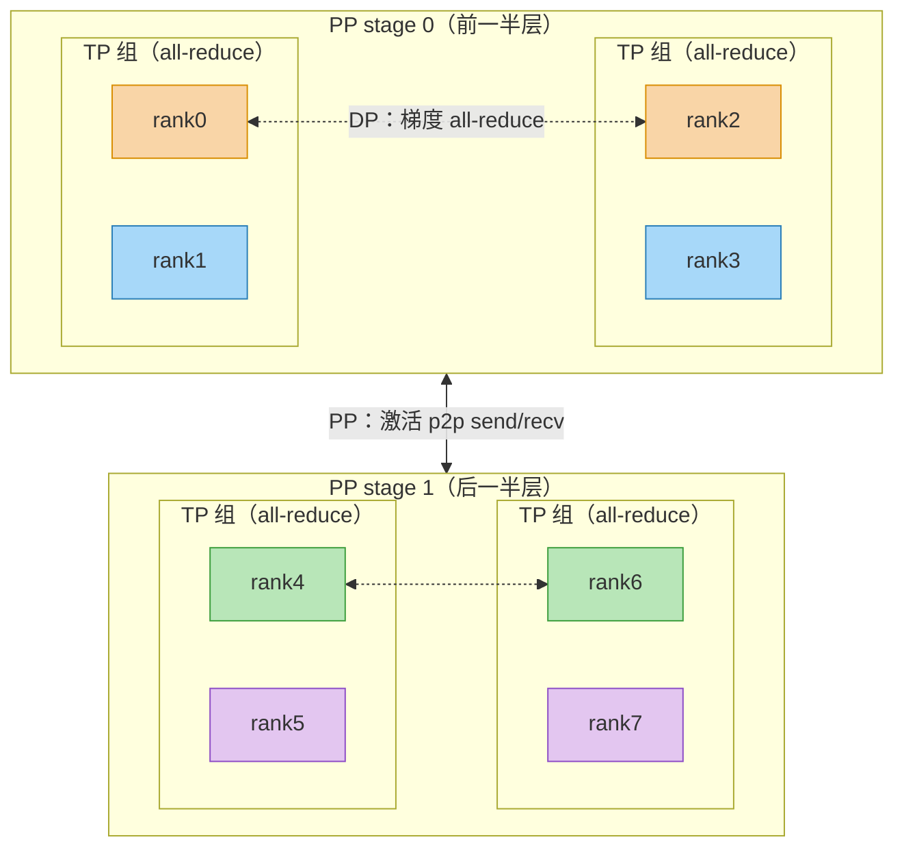

## 目录

- [Part 1 Nano-vLLM 的 TP 实现](#part-1-nano-vllm-的-tp-实现)
- [Part 2 Megatron-LM 与 Nano-vLLM 对照（推理部分）](#part-2-megatron-lm-与-nano-vllm-对照推理部分)
- [Part 3 Megatron-LM 的训练部分](#part-3-megatron-lm-的训练部分)
- [附录](#附录)

# Part 1 Nano-vLLM 的 TP 实现

Nano-vLLM 的张量并行不是"只有几个并行 Linear 层"，而是一整套**多进程推理系统**：层级负责切分与通信，引擎级负责把同样的前向广播到所有 rank 上同步执行。本节按这个顺序展开。

## 1.1 TP 进程模型

配置入口是 `Config.tensor_parallel_size`   `LLMEngine` 启动时：

```python
# nanovllm/engine/llm_engine.py:35-45
ctx = mp.get_context("spawn")                     # 必须 spawn：子进程要全新初始化 CUDA 上下文
for i in range(1, config.tensor_parallel_size):
    event = ctx.Event()
    process = ctx.Process(target=ModelRunner, args=(config, i, event))
    process.start()
    self.ps.append(process); self.events.append(event)
self.model_runner = ModelRunner(config, 0, self.events)   # rank0 留在主进程
```

- **rank 0** 运行在主进程，**rank 1..N-1** 是 spawn 出的独立子进程；
- 每个 `ModelRunner` 构造时调用 `dist.init_process_group("nccl", "tcp://localhost:2333", world_size, rank)`（`model_runner.py:37`）并 `torch.cuda.set_device(rank)`（`:38`）—— 一个 rank 对应一张卡；
- 各 rank **加载同一份完整 HF checkpoint，现场切出自己的分片**（见 1.2）。

关键机制是"**同步广播执行**"：NCCL 集合通信要求所有 rank 同时进入同一个 collective，所以必须保证各 rank 执行完全相同的调用序列。Nano-vLLM 用共享内存 + Event 实现：

```text
 主进程 (rank0)                              worker rank i (子进程)
 ───────────────                            ──────────────────────
 call("run", seqs, is_prefill)             loop():
   write_shm: pickle 方法名+参数                 read_shm:
     → 共享内存 buf[0..n]                          event.wait()      ← 阻塞等主进程唤醒
     → 对所有 event.set()   ──────唤醒──────►      读出 pickle 的方法名与参数
   ↓ 自己同步执行                                  event.clear()
   run(seqs, is_prefill)                        run(seqs, is_prefill)   ← 同一份代码
   ↓                                             ↓
   采样只在 rank0（见 1.7）                       返回 None
```


## 1.2 权重加载与切分基座

所有并行线性层共用基类 `LinearBase`：

```python
class LinearBase(nn.Module):
    def __init__(self, input_size, output_size, bias=False, tp_dim=None):
        self.tp_dim = tp_dim                  # 0=按输出维切，1=按输入维切，None=不切
        self.tp_rank = dist.get_rank()
        self.tp_size = dist.get_world_size()
        self.weight = nn.Parameter(torch.empty(output_size, input_size))  # 子类传入切分后尺寸
        self.weight.weight_loader = self.weight_loader   # 把 loader 挂到参数上
```

配合 `divide()`（不能整除直接断言失败）与 `utils/loader.py` 的 `load_model`：checkpoint 里分散的 `q_proj/k_proj/v_proj`、`gate_proj/up_proj` 通过 `packed_modules_mapping`（`models/qwen3.py:217-223`）映射到合并参数，再交给参数的 `weight_loader(param, tensor, shard_id)` 按 shard 写入对应分片。

> 与 Megatron 的分水岭：Nano-vLLM 是"**全量权重现场切分**"，Megatron 训练是"**构造期初始化 + 按分片存取**"（详见 2.3）。

## 1.3 词表并行（Vocab Embedding / LM Head）

### VocabParallelEmbedding 

词表按 TP 切：每个 rank 只持有 `vocab_size / tp_size` 行词向量。TP 下前向分三步：

```python
mask = (x >= self.vocab_start_idx) & (x < self.vocab_end_idx)    # 哪些 token 属于本 rank
x = mask * (x - self.vocab_start_idx)                            # 越界 token 置 0，查表不越界
y = F.embedding(x, self.weight)
y = mask.unsqueeze(1) * y                                        # 不属于本 rank 的输出清零
dist.all_reduce(y)                                               # 各 rank 部分求和 = 完整词向量
```

`tp_size == 1` 时全部跳过，就是普通 `F.embedding`。

### ParallelLMHead 

结构与 embedding 相同但方向相反（hidden → logits）。两个推理专属优化：

1. **prefill 只算末 token**：`x = x[context.cu_seqlens_q[1:] - 1]` —— 采样只需要每个序列最后位置的 logits，避免对整个序列做大输出投影；
2. **TP 下 gather 到 rank 0**：各 rank 算完自己词表分片的 logits 后 `dist.gather(logits, all_logits, 0)`，rank0 `cat` 成完整词表，**非 rank0 返回 None**。

| | VocabParallelEmbedding | ParallelLMHead |
|---|---|---|
| 切分维 | 词表维（dim 0） | 词表维（dim 0） |
| 通信 | all_reduce（合并各 rank 部分和） | gather（汇聚到 rank0） |
| 方向 | token → hidden | hidden → logits |

## 1.4 Self-Attention 的 TP

Attention 的 TP 布局（`nanovllm/models/qwen3.py:14-99`）：

```text
hidden_states (完整, 每 rank 一份)
   │
   ▼
qkv_proj = QKVParallelLinear (列并行, 按头切分)         ── 无通信
   │ 输出分片: [num_heads + 2*num_kv_heads] × head_dim (本 rank 的)
   ▼
q, k, v = qkv.split([q_size, kv_size, kv_size], -1)   ── 本地
q, k = q_norm(q), k_norm(k)                           ── 本地 (每 head 的 RMSNorm)
q, k = rotary_emb(positions, q, k)                    ── 本地 (每 head 独立旋转)
   ▼
Attention: 写 KV cache + flash attention              ── 本地 (每 rank 只算自己的 head)
   ▼
o_proj = RowParallelLinear (行并行)                    ── 末尾 all_reduce
   │
   ▼
输出 (完整, 每 rank 一份)
```

逐个拆解：

- **QKVParallelLinear**：`num_heads = total_num_heads / tp`、`num_kv_heads = total_num_kv_heads / tp`（GQA 支持）；输出维 `(total_heads + 2*total_kv_heads) * head_dim` 整体按输出维切分。`weight_loader` 按 `loaded_shard_id ∈ {q,k,v}` 计算各段在本地分片中的偏移写入。**关键点：切分单位是"头"**——本 rank 拿到一组完整连续的 head，后续 attention 计算完全本地、零通信。
- **KV cache 同样按头切分**：`num_kv_heads = hf_config.num_key_value_heads // world_size`，KV cache 形状 `[2, num_layers, num_blocks, block_size, num_kv_heads, head_dim]`，每个 rank 只持有自己的那组头——显存和计算同时除以 TP。
- **RoPE**（`layers/rotary_embedding.py`）：对每个 head 的 `head_dim` 维做半旋转，cos/sin 缓存每 rank 全量持有。因为 head 是完整的，RoPE 与 TP 完全正交，无需通信。
- **Attention 算子**：prefill 走 `flash_attn_varlen_func`（变长、因果、可带 prefix cache 的 `block_table`），decode 走 `flash_attn_with_kvcache`（单 query + KV cache 按 `block_table` 读取）；K/V 写入 KV cache 用自写 Triton kernel `store_kvcache`。
- **o_proj**（`qwen3.py:98` → `RowParallelLinear`，`linear.py:165-199`）：权重按输入维切（每 rank 持有 `hidden_size/tp` 列），各 rank 算部分和，**末尾 `dist.all_reduce(y)` 聚合成完整输出**。

## 1.5 MLP 的 TP

SwiGLU MLP（`qwen3.py:102-131`）：

```python
class Qwen3MLP(nn.Module):
    def __init__(self, hidden_size, intermediate_size, hidden_act):
        self.gate_up_proj = MergedColumnParallelLinear(hidden_size, [intermediate_size]*2)
        self.down_proj = RowParallelLinear(intermediate_size, hidden_size)
        self.act_fn = SiluAndMul()

    def forward(self, x):
        gate_up = self.gate_up_proj(x)   # 列并行, 输出分片 (2*intermediate_size/tp)
        x = self.act_fn(gate_up)         # 本地: chunk(2) → silu(gate)*up
        x = self.down_proj(x)            # 行并行, 末尾 all_reduce → 完整输出
        return x
```

- **MergedColumnParallelLinear**（`linear.py:92-117`）：`gate_proj` 与 `up_proj` 拼成一个权重，减少一次 kernel 调用；`weight_loader` 按 `loaded_shard_id`（0=gate, 1=up）定位子层在本地分片中的区间。
- **SiluAndMul**：`x.chunk(2, -1)` 后 `F.silu(x) * y`，把两次 kernel 合并为一次，与 fused gate/up 投影配套；带 `@torch.compile`。

## 1.6 数据流总结：每个 block 的"分片/完整"状态机

一个 Qwen3 decoder block 中，张量的并行状态（F=完整每 rank 一份，S=分片各 rank 持有 1/tp）：

```text
 F 输入 ──► input_layernorm ──► F ──► qkv_proj(列切) ──► S ──► split/norm/rope/attn ──► S
 S ──► o_proj(行切, all_reduce) ──► F ──► (+残差) ──► post_layernorm ──► F
 F ──► gate_up_proj(列切) ──► S ──► silu*up(本地) ──► S ──► down_proj(行切, all_reduce) ──► F
 F ──► (+残差, 进入下一层)
```

| 位置 | 切分方式 | 通信 |
|---|---|---|
| `embed_tokens` | 词表维 | all_reduce |
| `qkv_proj` | 输出维（按头） | 无 |
| attention 内部（norm/rope/attn/KV cache） | 本地（头完整） | 无 |
| `o_proj` | 输入维 | all_reduce（每层 1 次） |
| `gate_up_proj` | 输出维 | 无 |
| `down_proj` | 输入维 | all_reduce（每层 1 次） |
| `lm_head` | 词表维 | gather 到 rank0 |

**结论：每层前向恰好 2 次 all-reduce（o_proj + down_proj），加上词表两侧各 1 次聚合。** 

## 1.7 引擎级机制

- **仅 rank0 采样**：`token_ids = self.sampler(logits, temperatures).tolist() if self.rank == 0 else None`。因为 logits 只在 rank0 上被 gather 成完整词表（1.3），采样天然只在 rank0 发生，其他 rank 返回 None。
- **CUDA graph 与 TP 的关系**：`capture_cudagraph` 在**每个 rank 上各自 capture**——各 rank 的输入张量、`slot_mapping`、`context_lens`、`block_tables` 都是本 rank 的局部数据，回放时从 `graph_vars` 固定缓冲区拷入。注意 `slot_mapping.fill_(-1)`保证 padding 位不写 KV cache。TP 与 CUDA graph 正交：graph 只消除了 kernel 启动开销，通信仍按 NCCL 流发生。
- **KV cache 预算**：预热（`warmup_model`）测出峰值显存，剩余显存 ÷ 单块字节数 = 块数，其中 `num_kv_heads = total // world_size`，即 KV cache 显存随 TP 增大而按比例缩小。

## 1.8 边界与局限

Nano-vLLM 的 TP 是"够用且最小"的实现，明确不含以下能力：

1. **无 Sequence Parallelism**：所有激活（hidden states）在每个 rank 上都保持完整，只是权重/输出分片；
2. **无显式进程组抽象**：直接用 `dist.get_rank()/get_world_size()`，只支持单一 TP 组，无法叠加 DP/PP/EP；
3. **无反向路径**：纯推理，训练所需的 dgrad all-reduce、梯度同步全部不存在；
4. **无 SP 相关的通信缓冲复用、无 bias 融合等性能工程**。

这些正是 Part 3 中 Megatron 训练框架补上的东西。


# Part 2 Megatron-LM 与 Nano-vLLM 对照（推理部分）

## 2.1 对应关系总表

| 能力 | Nano-vLLM | vLLM | Megatron-LM |
|---|---|---|---|
| 列切分 `ColumnParallelLinear` | `layers/linear.py:63` | ✅ | ✅（鼻祖） |
| 行切分 + 末尾 all-reduce `RowParallelLinear` | `linear.py:165` | ✅ | ✅ |
| 不切分副本 `ReplicatedLinear` | `linear.py:44` | ✅ | 无（直接 `nn.Linear`） |
| 融合 gate/up `MergedColumnParallelLinear` | `linear.py:92` | ✅ | ✅（fused QKV 用） |
| 融合 QKV（GQA）`QKVParallelLinear` | `linear.py:120` | ✅ | 不合并，Q/K/V 各用独立 ColumnLinear |
| 词表并行 Embedding | `embed_head.py:9` | ✅ | ✅ `VocabParallelEmbedding` |
| 词表并行 LM Head | `embed_head.py:55` | ✅ | ✅（`ParallelLinear` + gather_output） |
| 权重加载 | `weight_loader` 现切 | `weight_loader` + 量化 | `init_method` + MP 属性 |
| 分布式 checkpoint | ❌ | ❌ | ✅ `sharded_state_dict` |
| `skip_bias_add` | ❌ | ✅ | ✅ |
| `gather_output` | ❌ | ✅ | ✅ |
| Sequence Parallelism | ❌ | 部分 | ✅ |
| 反向/梯度通信 | ❌ | ❌ | ✅ |


## 2.2 前向计算对照

| 维度 | Nano-vLLM / vLLM | Megatron（推理路径） |
|---|---|---|
| 列/行并行前向 | `F.linear`，行并行末尾 `dist.all_reduce`（`linear.py:88,195`） | 语义相同，通信包装成 autograd.Function 与区域原语 `mappings.py`（copy/gather/scatter/reduce），可选 `gather_output` |
| bias 处理 | 行并行只在 rank0 加 bias，避免重复累加 | 支持 `skip_bias_add=True`，返回 `(output, bias)` 供融合 |
| 通信位置 | 内联在 `forward` 里 | 抽成独立原语，层与并行边界解耦 |

核心结论：**前向数学与通信位置完全等价**，区别只在通信是否可配置、是否独立成层——Megatron 的包装层支撑了 SP/EP/CP 的自由组合。

## 2.3 权重来源对照

- **Nano-vLLM / vLLM（推理）**：`torch.empty` 分配 + `weight_loader` + `packed_modules_mapping`，从完整 HF checkpoint **现场切分**，每个 rank 各自 narrow 出自己那份。
- **Megatron（训练）**：构造期 `init_method` 初始化，并用 `set_tensor_model_parallel_attributes` 给参数打上 `tensor_model_parallel / partition_dim / partition_stride` 元数据（3.3 节 DP 梯度归约会用到）。

推理侧不需要 `sharded_state_dict`：权重只加载一次、只读不改，而分布式 checkpoint 面向"按分片存取、跨 TP/PP 布局重排"的训练场景（详见 3.5）。

## 2.4 通信次数对照

| 阶段 | 每层前向 all-reduce | 每层反向 all-reduce | 合计 |
|---|---|---|---|
| 推理（Nano-vLLM/vLLM） | o_proj + down_proj = **2 次** | 无 | **2 次/层** |
| 训练（Megatron） | 同上 2 次 | dgrad all-reduce ×2 | **4 次/层** |

通信量估算（LLaMA 6.7B 规模，hidden=4096, tp=4, ring all-reduce 口径）：单机 NVLink 全模型前向通信 ≈ 14 ms，跨机（~100 GB/s）≈ 129 ms。结论：**TP 只适合单机 NVLink**，跨机应改用 PP/DP。


# Part 3 Megatron-LM 的训练部分

## 3.1 训练主循环全景

顶层入口 `pretrain(...)`（`megatron/training/training.py`，签名含 `model_type` / `forward_step_func` / `model_provider` / `p2p_communicator` 等）。框架层面，训练 = 数据循环 × 前向/反向调度 × 优化器：

```text
pretrain()
 ├─ 初始化: 分布式环境、模型、优化器、LR schedule、数据
 ├─ for epoch:
 │    for iteration:
 │      ├─ forward_backward_func(...)      ← 由 get_forward_backward_func 选择调度器（3.3）
 │      │    内部完成: 前向 + 反向 + 梯度同步钩子
 │      ├─ optimizer.step()                ← MixedPrecisionOptimizer 流程（3.4）
 │      ├─ 记录 loss / 更新 LR / loss scaling
 │      └─ 周期性 save_checkpoint(iteration, ...)   ← megatron/training/checkpointing.py
 └─ 退出清理
```

几个关键点：

- `get_forward_backward_func` 按 PP/虚拟 PP 规模在三种调度器间选择（`schedules.py`，分支条件见 3.3(c)）；
- 梯度裁剪、loss scaling 更新**不在训练循环里**，而在优化器内部（`MixedPrecisionOptimizer.step`，3.4）。

## 3.2 并行维度组合：五类进程组

`initialize_model_parallel`（`megatron/core/parallel_state.py`）的完整签名

```python
initialize_model_parallel(
    tensor_model_parallel_size=1,
    pipeline_model_parallel_size=1,
    virtual_pipeline_model_parallel_size=None,
    pipeline_model_parallel_comm_backend=None,
    context_parallel_size=1,
    expert_model_parallel_size=1,
    gtp_remat_size=1,
    num_distributed_optimizer_instances=1,
    expert_tensor_parallel_size=None,
    order="tp-cp-ep-dp-pp",     # 组构造顺序（RankGenerator 按此生成正交组）
    ...,
)
```

**数据并行度是推算出来的**：`dp = world / (tp × pp × cp × gtp_remat)`。五个并行维度的分工：

| 维度 | 切什么 | 通信原语 | 对应 Nano-vLLM |
|---|---|---|---|
| TP | 单层权重（列/行切） | all-reduce / all-gather / reduce-scatter | ✅（全部） |
| SP | 序列维的激活（配合 TP） | all-gather / reduce-scatter | ❌ |
| PP | 层（stage 切分） | p2p send/recv | ❌ |
| DP | 数据（梯度同步） | 梯度 all-reduce / reduce-scatter | ❌ |
| EP | 专家（MoE） | all-to-all | ❌ |

以 8 卡、`tp=2 × dp=2 × pp=2` 为例，各进程组的实际划分：



读图要点：**同色的 rank 属于同一个 DP 组**（持有相同的模型分片、吃不同的数据，反向后同步梯度）；`order="tp-cp-ep-dp-pp"` 意味着 **TP 组占据连续的 rank 编号**（rank0/1、rank2/3……），编排时自然落在同一台机器内走 NVLink，而 PP 步长最大、天然跨机——这与 2.4 节"TP 走单机 NVLink、跨机用 PP"的通信量结论互为印证。SP/EP/CP 未在图中画出：SP 与 TP 同组、只是把激活沿序列维切开；EP 用于 MoE 专家；CP 沿序列维再切。

## 3.3 前向/反向的分布式机制

### (a) TP 的反向补全：`LinearWithGradAccumulationAndAsyncCommunication`

`layers.py` 里，Column/Row 并行层的前向不再只是 `F.linear`，而是走一个 autograd.Function，反向阶段补回推理时被裁剪掉的东西：

1. **`allreduce_dgrad`**：输入梯度（dgrad）的 all-reduce 以 `async_op=True` 发起，与权重梯度计算重叠——这就是共轭关系在训练里的另一半；
2. **`sequence_parallel`**：前向对输入做 all-gather（用 `get_global_memory_buffer()` 复用通信缓冲），反向对输入梯度做 reduce-scatter；
3. **`gradient_accumulation_fusion`**：权重梯度直接累加进优化器的 `main_grad`（需 Apex 的 `fused_weight_gradient_mlp_cuda`，且 `config.gradient_accumulation_fusion` 开启），省一次加法 kernel。

重叠依赖 `CUDA_DEVICE_MAX_CONNECTIONS=1` 保证 kernel 调度顺序。推理路径则走 `LinearWithFrozenWeight`（`weight.requires_grad == False`），只有 matmul 与可选的 dgrad all-reduce。

### (b) Sequence Parallelism（SP）

当 `config.sequence_parallel` 开启时，**激活按序列维切分**（而非只在 TP 各 rank 复制）：

- Column 并行层出口：`reduce_scatter_to_sequence_parallel_region`（输出从完整变序列分片）；
- Row 并行层入口：`all_gather_from_sequence_parallel_region`（输入从序列分片变完整）；
- 好处：LayerNorm/Dropout 等"无权重"激活模块的显存除以 TP 大小，激活显存显著下降（训练重激活内存的利器）。

### (c) Pipeline Parallelism（PP）与 1F1B 调度

层被切到多个 stage，每个 rank 只持有部分层。调度器按并行规模选择：`pp_size==1` → `forward_backward_no_pipelining`；`pp_size>1` 且虚拟 PP 层数（`vp_size`）非空 → `forward_backward_pipelining_with_interleaving`，否则 → `forward_backward_pipelining_without_interleaving`。核心调度函数：

- `get_pp_rank_microbatches(num_microbatches, ...)` 返回 `(total_num_microbatches, num_warmup_microbatches, num_microbatches_remaining)`——非 interleaved 时 `num_warmup_microbatches = pp_size - pp_rank - 1`，即**先纯 forward 预热**，把流水线灌满，然后进入"前向-反向交替"的 **1F1B 稳态**（一次前向紧跟一次反向，减少激活滞留）；
- 通信走 `P2PCommunicator` 类（`p2p_communication.py`）的 `send_forward/recv_forward/send_backward/recv_backward` 等方法，底层 `_batched_p2p_ops` 用 `batch_isend_irecv`，可选 `use_ring_exchange_p2p`；
- **Interleaved（虚拟 PP）**：`virtual_pipeline_model_parallel_size > 1` 时把每层组再切块（chunk），同一 rank 交替计算不同 chunk，缩短流水线气泡；
- `num_microbatches` 权衡：越多越能填满流水线，但前向激活滞留更多、调度开销更大。

### (d) Data Parallel（DP）与梯度同步

- DP 组内各 rank 持有**相同的模型分片**（同一 TP/PP 位置）、不同的数据，反向结束后需要把梯度同步；
- 抽象是 `TransformerConfig` 上的四个钩子：`no_sync_func` / `grad_sync_func` / `param_sync_func` / `finalize_model_grads_func`——调度器通过它们插入"延迟梯度同步/参数同步"（overlap 训练的关键，如 DDP 的 `--overlap-grad-reduce`）；
- 与 TP 的关系：**被 TP 切分的参数梯度天然按 rank 分好，不需要跨 DP rank 全量归约**——这正是 2.3 节 `set_tensor_model_parallel_attributes` 元数据的用武之地。

### (e) Expert Parallelism（EP，MoE）

- `MoELayer`（`moe/moe_layer.py`）：`assert num_moe_experts % ep_size == 0`，`num_local_experts = num_moe_experts // ep_size`，`local_expert_indices` 从 `ep_rank * num_local_experts` 连续编号；
- token 路由：`MoETokenDispatcher` 抽象 → `MoEAlltoAllTokenDispatcher`（`token_dispatch`/`token_combine` 里对 `self.ep_group` 做 `all_to_all`）或 `MoEAllGatherTokenDispatcher`；类型由 `config.moe_token_dispatcher_type`（`'allgather'/'alltoall'/'flex'`）选择；
- 前向流程：router 选 top-k 专家 → dispatch（all-to-all 把 token 送到对应专家所在的 rank）→ 专家计算 → combine（all-to-all 送还）→ 输出。

### (f) Context Parallelism（CP）

`context_parallel_size` 沿序列维再切一层（配合 ring attention / hybrid CP 调度 `hybrid_context_parallel_forward_backward`），用于超长序列。Nano-vLLM 场景不需要，此处不展开。

## 3.4 优化器与混合精度

类层级：

```text
MegatronOptimizer (ABC)
 ├─ MixedPrecisionOptimizer
 │    ├─ Float16OptimizerWithFloat16Params   # fp16/bf16 参数 + fp32 master weight + 动态 loss scaling
 │    └─ (DistributedOptimizer 分支)
 └─ DistributedOptimizer(MixedPrecisionOptimizer)   # 优化器状态按 DP rank 分片
```

### 混合精度与 master weight

- 模型参数以 fp16/bf16 存储（`params_dtype`），每个参数附带 fp32 副本 **`param.main_param`**；梯度先累积到模型侧 **`param.main_grad`**，再由 `_copy_model_grads_to_main_grads()` 转成 fp32（`main_param.grad = model_param.main_grad.float()`）；
- 更新在 fp32 完成，再 `reload_model_params()` 拷回低精度参数——避免低精度训练中的累积误差；
- 动态 loss scaling：梯度出现 inf/nan 时跳过本次更新并自动下调 scale，防止梯度爆炸污染权重；相关配置：`initial_loss_scale` / `min_loss_scale` / `loss_scale_window` / `hysteresis`（`OptimizerConfig`）。

`step()` 的标准流程：

```text
optimizer.step()
 ├─ prepare_grads()        # 拷贝梯度到 main_grad + 检查 inf/nan + 更新 loss scale
 ├─ 若 inf: 跳过更新
 ├─ clip_grad_norm(clip_grad)   # 全局梯度范数裁剪（fp32）
 ├─ count_zeros()
 └─ step_with_ready_grads()     # 真正的参数更新
```

### 分布式优化器（DistributedOptimizer）

`use_distributed_optimizer`（`OptimizerConfig`，注释"Distribute optimizer state over data-parallel replicas"）开启后：

- 优化器状态（Adam 的 m/v，甚至 fp32 主权重）不再在 DP 组内每 rank 各存一份，而是**按 DP rank 切分**：`_build_model_gbuf_range` 把每个参数梯度桶的连续缓冲均分为 `data_parallel_world_size` 段，本 rank 拥有第 `data_parallel_rank` 段（`gbuf_world_range`）；
- 训练时**梯度 reduce-scatter**（各 rank 只得到自己那段的归约结果）、更新后**参数 all-gather** 回全量——这是 ZeRO 风格的状态分片，显存随 DP 扩展；
- 与 TP 的关系：TP 切分的参数（`tensor_model_parallel=True`）在 DP 组内是完整副本、需要归约；分片范围按反向传播顺序排布，`partition_buckets`/`pad_bucket_end` 保证桶长度可被 DP 整除。

## 3.5 工程机制

### 激活重计算（Activation Recomputation）

`TransformerConfig` ：`recompute_granularity: Literal['full','selective']`、`recompute_method: Literal['uniform','block']`、`recompute_num_layers`、`recompute_modules`。机制：前向不保存某些层的激活（只存输入），反向时重算——用算力换显存；`selective` 只重计算 attention 这类"省得多、算得少"的部分。

### 分布式 checkpoint 与重排

- `megatron/core/dist_checkpointing/serialization.py`：`save(sharded_state_dict, checkpoint_dir, ...)` / `load(sharded_state_dict, checkpoint_dir, ...)`，以当前模型的 `ShardedTensor`（含 `global_shape` / `global_offset`）为映射按需读取分片；
- **支持跨并行配置重排（resharding）**：`check_checkpoint_args` 只在 `not args.use_dist_ckpt` 时强制比对 TP/PP 大小，即使用分布式 checkpoint 后，**可以用不同的 TP/PP/EP/DP 布局加载旧 checkpoint**（例如 4×TP 的存档换成 8×TP 恢复训练）；
- 优化器状态也有可重排格式：`DistributedOptimizer.checkpoint_fully_reshardable_formats`（`'fully_reshardable'` / `'fully_sharded_model_space'` / `'fsdp_dtensor'`）。

### 其他

- LR schedule：与 optimizer 并列调度（`opt_param_scheduler` 传入 `save_checkpoint`）；
- Loss 聚合：`calculate_per_token_loss`（按 token 数归一化，多 micro-batch 与 pipeline 下口径一致）；
- fp8 训练：`fp8: Literal['e4m3','hybrid']` + TransformerEngine 集成（`HAVE_TE` 分支替换 GEMM）。

## 3.6 最终对照表：推理 vs 训练

| 维度 | Nano-vLLM / vLLM（推理） | Megatron（训练） |
|---|---|---|
| 并行维度 | 仅 TP（单组） | TP×SP×PP×DP×EP×CP 可组合 |
| 精度 | 加载即用（fp16/bf16） | fp16/bf16 参数 + fp32 master weight + 动态 loss scaling |
| 激活 | 常驻推理路径 | 可重计算（full/selective）、可 SP 切分 |
| 优化器 | 无 | Adam + 分布式优化器（状态按 DP 分片）+ 梯度累积融合 |
| 显存策略 | 剩余显存全给 KV cache | 参数/梯度/状态/激活四部分精细预算 |

---

# 附录

## 源码文件索引

**Nano-vLLM（本仓库）**

| 文件 | 关注点 |
|---|---|
| `nanovllm/layers/linear.py` | LinearBase / Column / Row / MergedColumn / QKV 并行层 |
| `nanovllm/layers/embed_head.py` | VocabParallelEmbedding / ParallelLMHead |
| `nanovllm/layers/attention.py` | KV cache 写入 + flash attention 两条路径 |
| `nanovllm/layers/activation.py` | SiluAndMul 融合激活 |
| `nanovllm/layers/rotary_embedding.py` | RoPE（与 TP 正交） |
| `nanovllm/layers/layernorm.py` | RMSNorm + 融合残差 |
| `nanovllm/models/qwen3.py` | packed_modules_mapping、Attention/MLP/DecoderLayer 组装 |
| `nanovllm/utils/loader.py` | weight_loader 分发 |
| `nanovllm/engine/model_runner.py` | 进程组、共享内存广播、KV cache、CUDA graph |
| `nanovllm/engine/llm_engine.py` | spawn 子进程、step 循环 |

**Megatron-LM（`main` 分支，2026）**

| 文件 | 关注点 |
|---|---|
| `megatron/training/training.py` | `pretrain` 入口、训练循环组织 |
| `megatron/training/checkpointing.py` | `save_checkpoint` / `load_checkpoint` |
| `megatron/core/tensor_parallel/layers.py` | Column/Row/Embedding + 训练算子 |
| `megatron/core/tensor_parallel/mappings.py` | 六个区域通信原语 |
| `megatron/core/parallel_state.py` | `initialize_model_parallel`、进程组 getter |
| `megatron/core/pipeline_parallel/schedules.py` | 1F1B / interleaved 调度 |
| `megatron/core/pipeline_parallel/p2p_communication.py` | `P2PCommunicator` |
| `megatron/core/optimizer/optimizer.py` | 优化器类层级、混合精度 step 流程 |
| `megatron/core/optimizer/distrib_optimizer.py` | 分布式优化器（状态按 DP 分片） |
| `megatron/core/optimizer/optimizer_config.py` | `OptimizerConfig`（loss scale、use_distributed_optimizer 等） |
| `megatron/core/transformer/transformer_config.py` | `TransformerConfig`（recompute / fp8 / moe 等字段） |
| `megatron/core/transformer/moe/moe_layer.py` | `MoELayer` |
| `megatron/core/transformer/moe/token_dispatcher.py` | all-to-all / all-gather 路由 |
| `megatron/core/dist_checkpointing/serialization.py` | `save` / `load`、重排支持 |

## 参考资料
 
- NVIDIA/Megatron-LM：<https://github.com/NVIDIA/Megatron-LM>
- vLLM：<https://github.com/vllm-project/vllm>
- Shoeybi et al., *Megatron-LM: Training Multi-Billion Parameter Language Models Using Model Parallelism*, 2019（TP 出处）
- Narayanan et al., *Efficient Large-Scale Language Model Training on GPU Clusters Using Megatron-LM*, 2021（1F1B pipeline）
- Korthikanti et al., *Reducing Activation Recomputation in Large Transformer Models*, 2022（SP 与选择性重计算）
- Fedus et al., *Switch Transformers*, 2021；Rajbhandari et al., *ZeRO: Memory Optimizations Toward Training Trillion Parameter Models*, 2020（分布式优化器背景）
